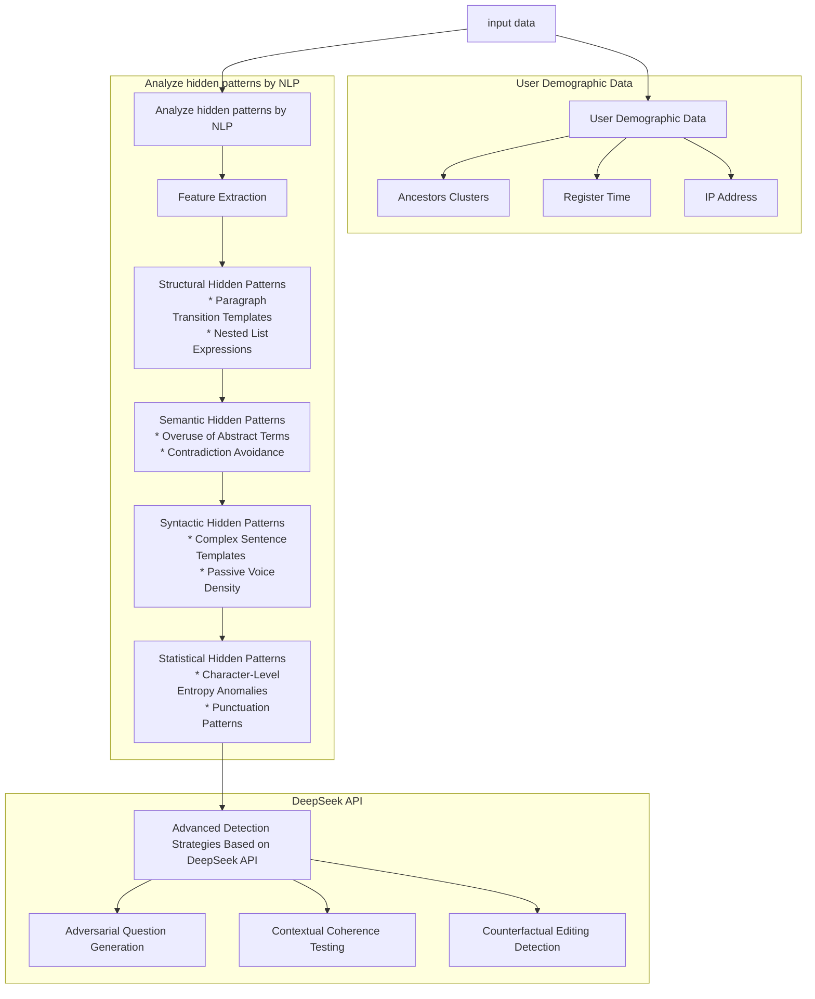

```mermaid

graph TD
A[input data] --> B[User Demographic Data]
A --> C[Analyze hidden patterns by NLP]
subgraph User Demographic Data
B --> B1[Ancestors Clusters]
B --> B2[Register Time]
B --> B3[IP Address]
end
subgraph Analyze hidden patterns by NLP
C --> C1[Feature Extraction]
C1 --> C2["Structural Hidden Patterns
           * Paragraph Transition Templates
           * Nested List Expressions"]
C2 --> C3["Semantic Hidden Patterns
           * Overuse of Abstract Terms
           * Contradiction Avoidance"]
C3 --> C4["Syntactic Hidden Patterns
           * Complex Sentence Templates 
           * Passive Voice Density"]
C4 --> C5["Statistical Hidden Patterns
           * Character-Level Entropy Anomalies
           * Punctuation Patterns"]
end

C5 --> M[Advanced Detection Strategies Based on DeepSeek API]
subgraph DeepSeek API
M --> M1[Adversarial Question Generation]
M --> M2[Contextual Coherence Testing]
M --> M3[Counterfactual Editing Detection]
end
```
