# BeSample_Demo
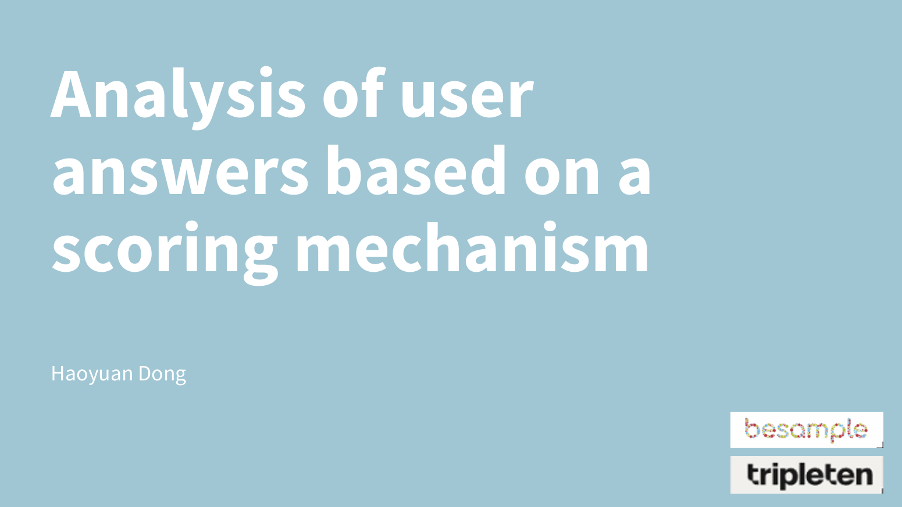

Besample is facing challenges with bot attacks. Our objectives are to identify key features that distinguish real users from bot users and to identify bot users as accurately as possible.

My Methodology for this project is based on the assumption that fraudulent users will participate in the business as much as possible to maximize their fraudulent profits.

Additionally, they will fill out surveys by automated methods to minimize their time and effort costs.

The challenges of this project are that the bot users are very realistic, and the "isbot" column was not necessarily accurate, it has time limitations. 

As shown in the figure, the values of isBot are limited to around January 15. but the registration of over 400 users on March 7 seems abnormal but there's no true values in "isBot" column. Therefore this task is more like a unsupervised learning project

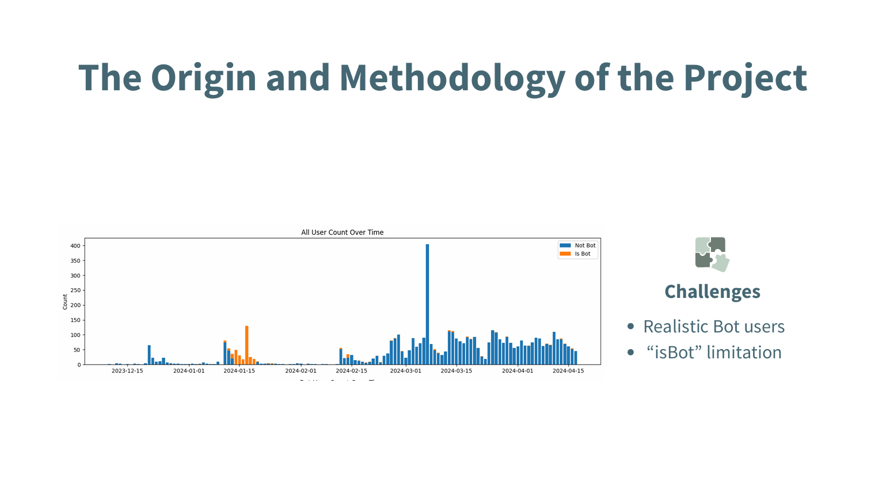

My team members have already made brilliant analyses on these datasets, but I am particularly interested in the demography_body and eyal_answers columns in the profile table. The reasons are

1. They have enough data

2. Open-ended questions can support my hypothesis that bot users will answer questions as quickly as possible to reduce costs. These answers tend to have certain patterns, such as identical responses.

So I chose Qid-11  and QID154 because these questions related to describe yourself, such as habit and career, This means user responses are long enough, making them suitable for NLP analysis.

Additionally, I also selected these columns to support my analysis

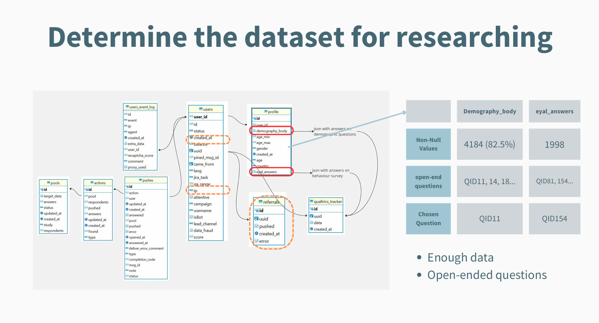

Besample's business spans across multiple countries worldwide, so there are various languages. 

First is the language

The most commonly used language is Ukrainian, with over 3,400 users, followed by Russian with 530 users.

In order to analyze and input answers into the NLP model, I have translated these languages into English uniformly.

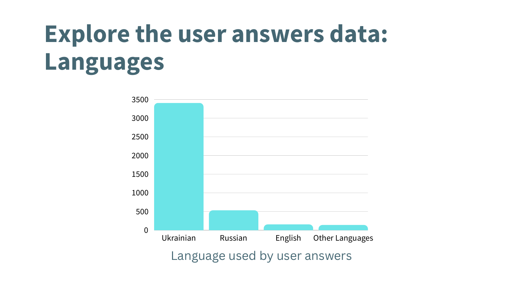

Then, I analyzed the word frequency, and you can see that adjectives and verbs have a high proportion. please note, some adjectives like "responsible," "creative," and "purpose" are quite suspicious. I will metion these later.

QID11:
There are 4500 words happened in user answers. 75% of them showed less than and equal to 5 times. The top 5 frequent words are: "like" 1725, "work" 1413, "love" 857, "responsible" 691 and "person" 552.

QID154:2300 words, 75% of them showed less than and equal to 4 times. read243，sports164，travel144,

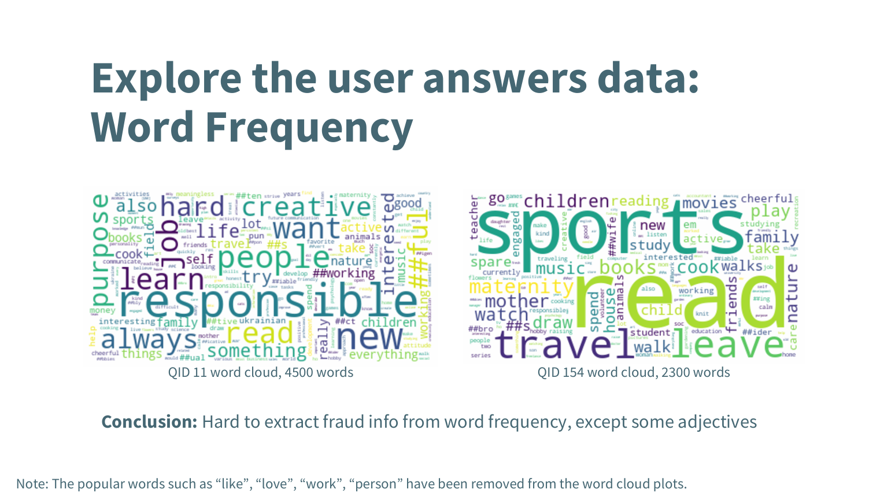

Next, I found completely identical user answers. 

This step is easy to find bot users, but there are only 40 same answers in QID11. We couldn't identify bot users only by this feature.

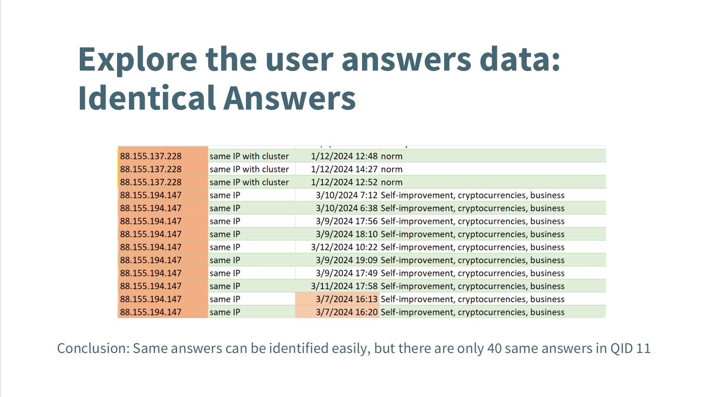

Since directly looking at identical user answers doesn't solve the problem, I need to bring in more columns. 

First, I counted each user's referral ancestors and found that multiple users share the same ancestor. I call them as clusters.

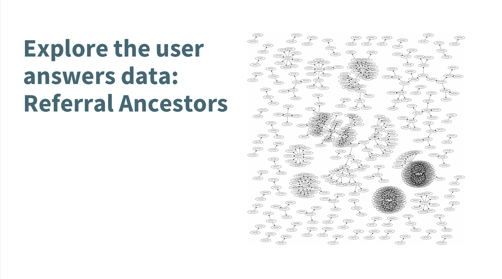

Then I manually marked 11 clusters with more than 10 users each. we can see clusters 1, 2, 3, and 11 have the most users.

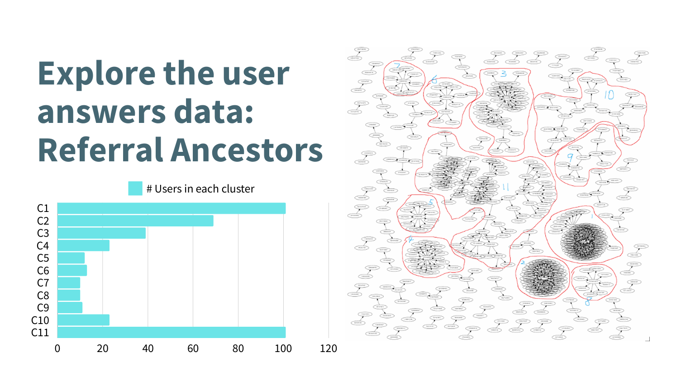

Then I examined the user answers within each cluster and found some very similar answer patterns, such as the Ukrainian young person pattern. For these users, I have high confidence in considering them as bot users.

The limitation of relying on referral ancestors to find Bot users is that only 492 users have ancestors, which is less than one-tenth of all users. 

Additionally, since the company needs to spend budget to promote the referral plan, we can't rely solely on this feature in the long run.

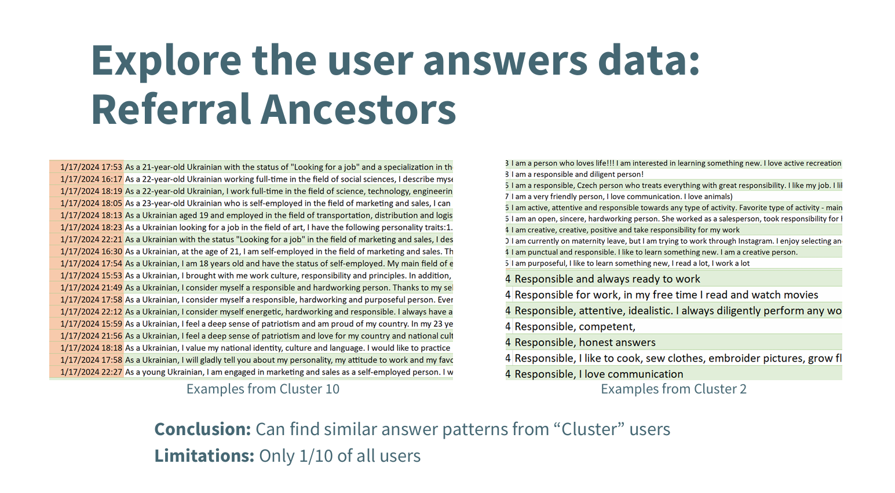

I also found similar answer patterns using reduplicated IP addresses and peak registering times. 

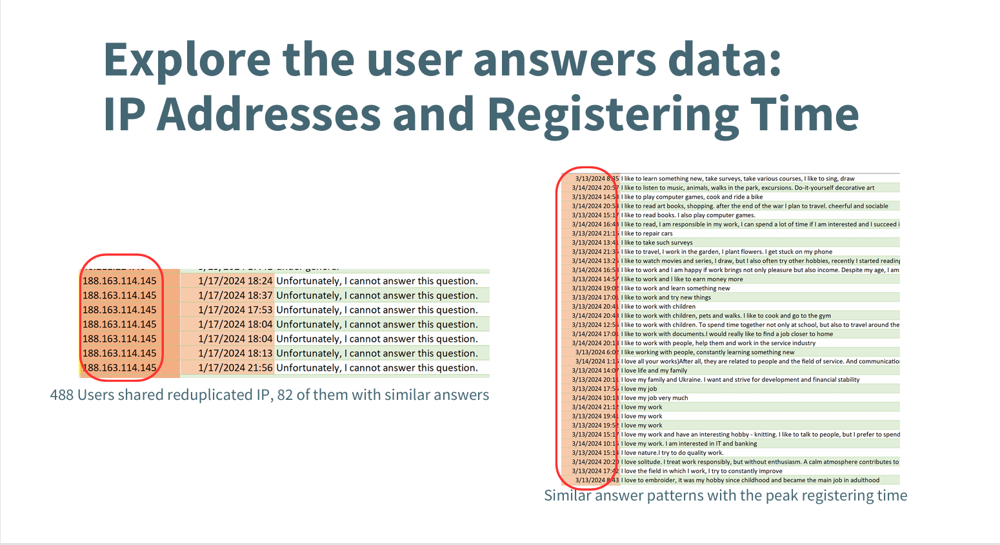

I believe the most significant finding is I identified many user answer patterns.

Please note, These patterns are different from completely identical user responses; 

first, they have tiny differences. such as these 3 sentences, they all have responsible and hardworking person, but there's tiny different between them

If you exam each sentence individually, they all appear normal. However, when you put them together, you'll notice similar patterns. 

Especially when combined with the previously mentioned features such as  registration time, IP addresses, and clusters, you'll see that there is definitely abnormal

So, my conclusion is that someone is using some sort of sentence generation method to automatically generate user answers by inputting keywords or something. But I'm not sure what tools they used, maybe Genarative AI or other ways

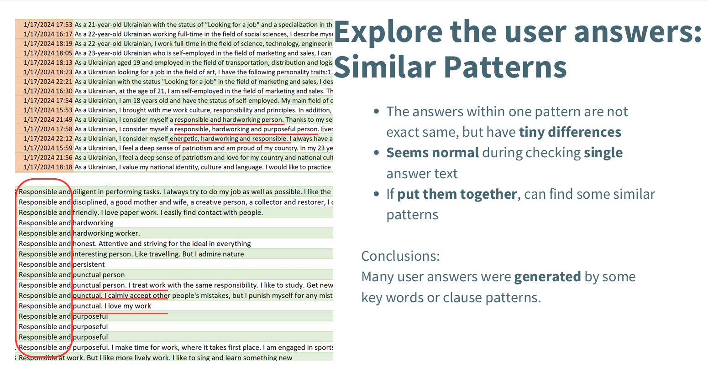

In order to further analyzing, I identified 27 patterns from all user responses and divided them into 5 suspicious levels. Then assigned weights for each level

The most suspicious pattern, like the Ukrainian young person pattern, etc. 

However, if we rely on manual screening, it not only consumes a lot of manpower but also introduces subjective judgment errors.

Please note that the user answers that fit these patterns don't just contain the same words. They also match in sentence structure, as well as the placement of adjectives and verbs, and other things. 

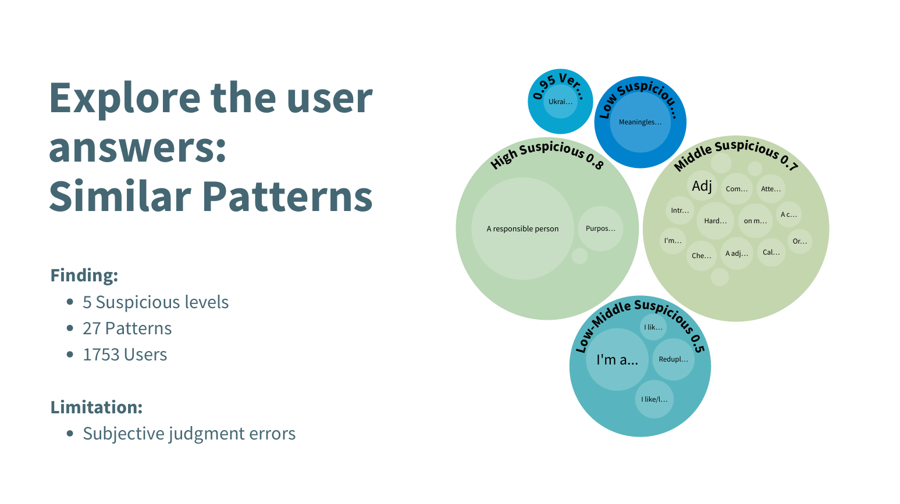

To reduce subjective judgment errors, I introduced sentence similarity from NLP algorithms. 

I selected 118 example sentences from the patterns and calculated the similarity of each user's answer to these examples.

To better consider context and sentence structure, I used a sentence-transformer model based on the BERT architecture.

From the histogram of the calculation results, most user answers have a similarity score between 0.5 and 0.7.

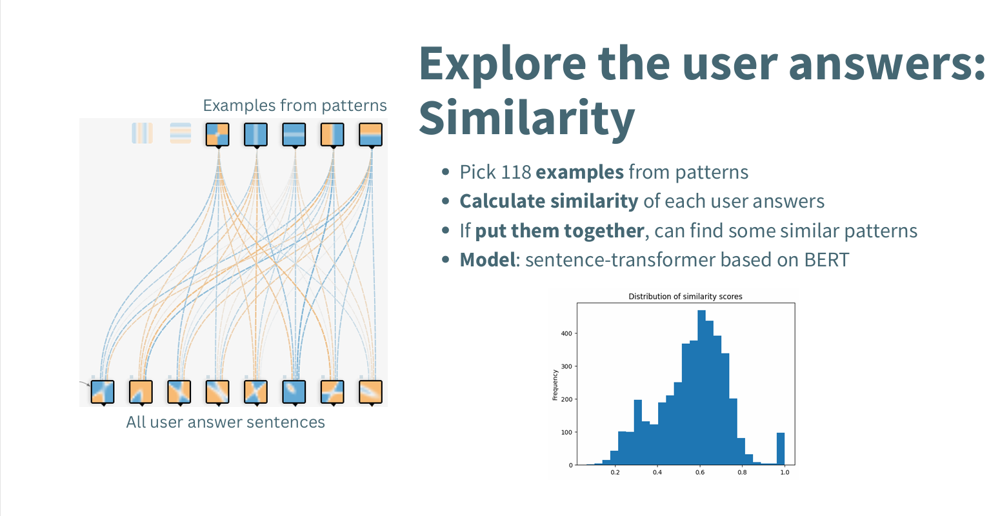

I created a scoring mechanism, assigning weights to clusters, IP addresses, registration times, answer patterns, and pattern scores. 

In each feature group has its different point values. 

Finally, I calculated a Bot Score for each user.

As I mentioned earlier, no single column can perfectly determine if a user is a bot. 

The advantage of this scoring mechanism is that it integrates multiple features. Additionally, it allows to add other features, such as demo_speedrun and answer consistency, which my team members have analyzed. 

It also makes it easy to adjust the weights of each feature.

The drawback is that setting the thresholds and weights can be quite subjective.

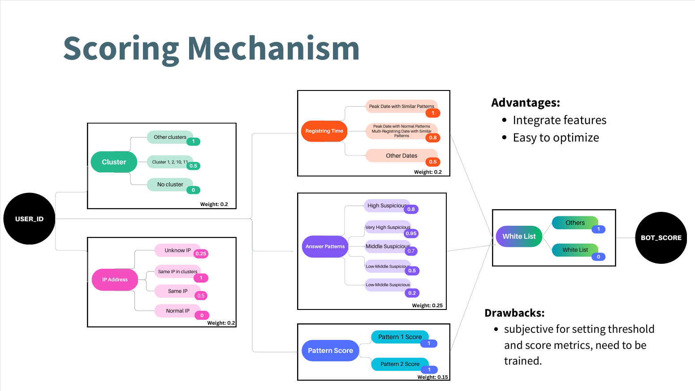

Based on this scoring system, I calculated scores for all users. 

This chart shows the distribution of the scores.

If we set the threshold is 0.7, there will be 755 users.

Compare to the given IsBot values, 150 users, 40% users covered by this prediction

I checked the false negative users, many of them are have certain patterns, such as empty input or IP == unknow, which in my scoring system, I assigned not very high score to them. But in the future, I can consider them to higher suspicious, it will make the model better.

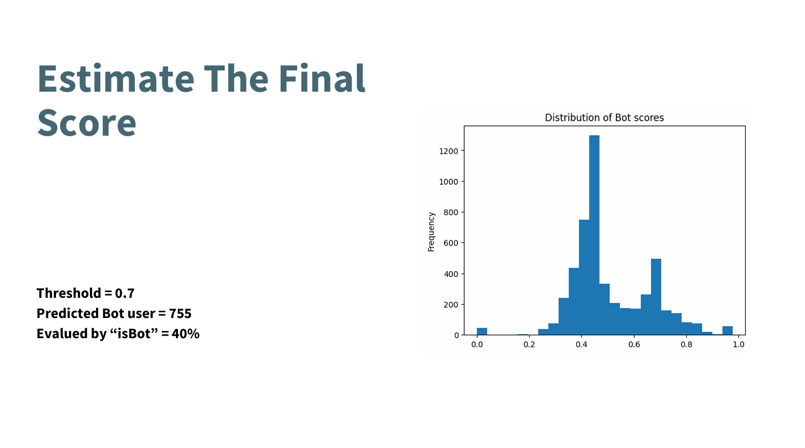

Here's the next steps I suggested.

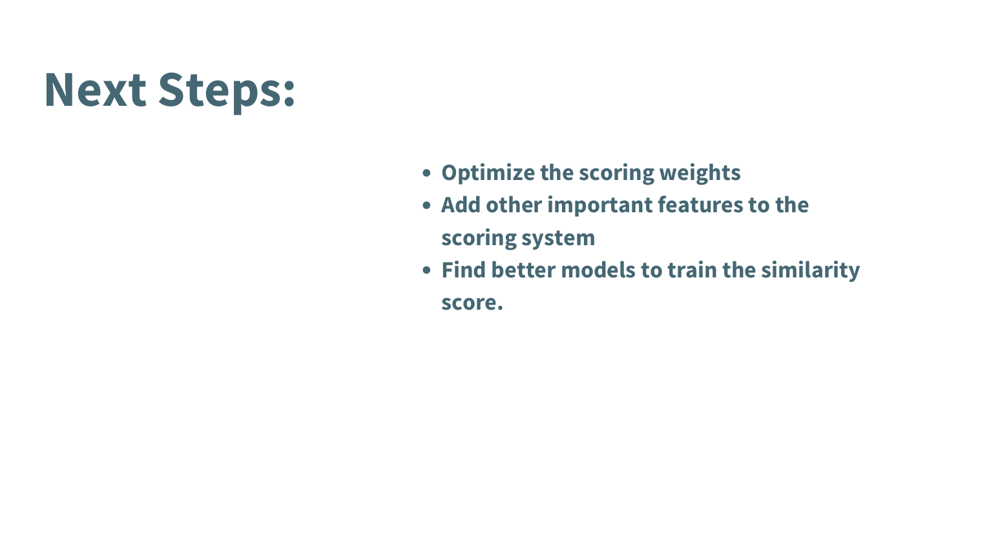
